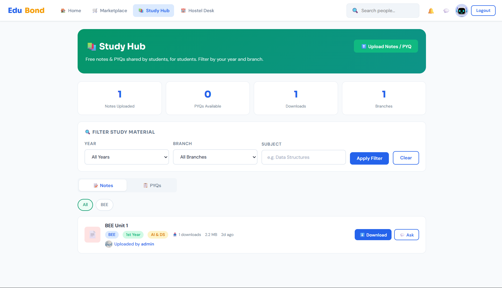
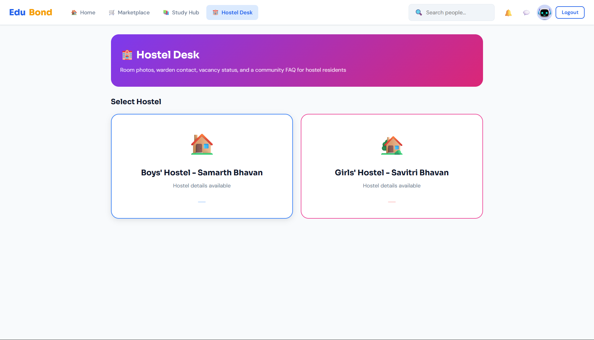

# EduBond 🎓
> Connecting Students, Seniors, and Alumni for a better Academic Journey.

EduBond is a college-focused platform where students can create profiles using their institutional email IDs. It facilitates the sharing of academic notes, provides structured study roadmaps, and features a student-to-student marketplace for stationery and study materials.

---

## 📸 Project Tour

### 🔐 Gateway
EduBond ensures a secure, campus-only environment with mandatory institutional email verification.


---

### 🏠 Student Dashboard & Marketplace
The central hub for campus news, upcoming events like Tech Fest 2025, and a student-to-student marketplace.

| Home Dashboard | Campus Marketplace |
| :---: | :---: |
|  |  |

---

### 📚 Study Hub & Hostel Desk
Filter study materials by year/branch or check real-time hostel availability and warden contacts.

| Study Hub (Notes & PYQs) | Hostel Desk |
| :---: | :---: |
|  |  |

---

### 👤 User Profile & Networking
Showcase your academic identity and manage your campus connections.


---

# ✨ Features
* Verified Profiles:** Mandatory college email login to ensure a safe, campus-only community.
* Alumni Network:** Connect with seniors and alumni for mentorship and guidance.
* Academic Hub:** Share free notes and follow subject-specific roadmaps.
* Stationery Marketplace:** Buy or sell second-hand scientific calculators and other materials.
* Grievance Portal:** A streamlined way to report issues to the relevant college sections.
* Events Tracker:** Stay updated on upcoming college fests, workshops, and seminars.

---

# Tech Stack
- Backend: Django 5, Django REST Framework, JWT (SimpleJWT), Channels + Redis
- Frontend: Static HTML/CSS/JS pages in the repo root
- DB: SQLite by default (replaceable with Postgres/MySQL)
- Media: Pillow for image uploads
- Dev helpers: django-extensions, django-cors-headers
  
---

# Project Layout
- `manage.py`, `settings.py`, `urls.py` – Django project entrypoint/config
- `apps/` – Django apps (auth, community, marketplace, studyhub, hostel, chat, etc.)
- `media/` – Uploaded files (kept out of version control)
- `home.html`, `index.html`, `studyhub.html`, `marketplace.html`, `hostel.html`, `messages.html`, `profile.html`, `style.css`, `utils.js`, etc. – Static UI
- `BACKEND_SETUP.md` – API endpoints and backend notes

---

# Quick Start
```bash
git clone https://github.com/sagarpc1006/EDUBOND.git
cd <repo-folder>

# 1) Create and activate a virtualenv
python -m venv .venv
.\.venv\Scripts\activate   # Windows
# source .venv/bin/activate   # macOS/Linux

# 2) Install dependencies
pip install -r requirements.txt

# 3) Django setup
python manage.py makemigrations
python manage.py migrate

# 4) (Optional) create admin
python manage.py createsuperuser

# 5) Run dev server
python manage.py runserver
# visit http://127.0.0.1:8000
